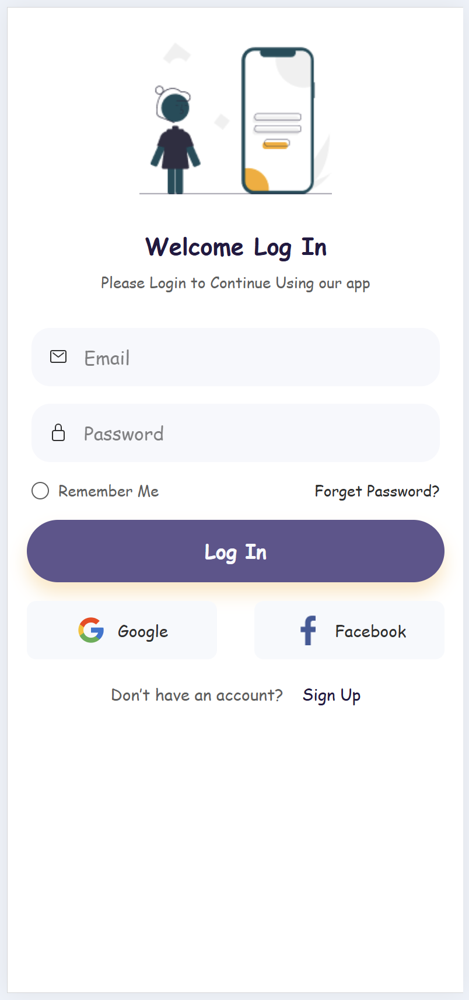

# ionic-react-sample

This sample was created as part of [GAI Academy](https://gaiacademy.org) mobile app development bootcamp.

## How to test the app
To test this, you can execute the following commands:

1. `npm install`
2. `ionic serve`
3. The sample should now be displayed in your browser
4. On your browser, enable developer tools using this keyboard shortcut: `CTRL + SHIFT + I`
5. On your browser, enable device toolbar using this keyboard shortcut: `CTRL + SHIFT + M`

## How to package the app
To package your app for deployment, you can execute the following commands:

For Android:
1. Install and setup Android Studio (if it is not already installed)
2. Execute the following command: `ionic capacitor build android`
3. [Install](https://developer.android.com/studio/run/emulator-install-add-files) the app on your device

For iOS:
1. Install and setup Xcode (if it is not already installed)
2. Execute the following command: `ionic capacitor build ios`

## Sample screen

Here's a sample of what your screen should look like.

